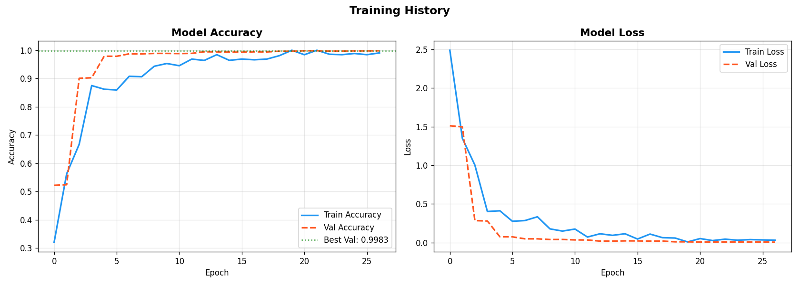

# 🚦 Traffic Sign Recognition for Autonomous Vehicles

> An AI-powered Traffic Sign Recognition system built using **Deep Learning**, **TensorFlow**, **OpenCV**, and **Python** to accurately classify traffic signs from images and support intelligent transportation systems.




---

## 📌 Project Overview

Traffic Sign Recognition is a fundamental component of Advanced Driver Assistance Systems (ADAS) and Autonomous Vehicles.

This project uses a Convolutional Neural Network (CNN) trained on traffic sign images to recognize and classify road signs with high accuracy. The application allows users to test images through a simple interface and predicts the corresponding traffic sign.

---

## ✨ Features

- 🚦 Automatic Traffic Sign Classification
- 🧠 Deep Learning based CNN Model
- 📷 Image Upload Prediction
- ⚡ Fast and Accurate Inference
- 🎯 Confidence Score Display
- 📊 Top-K Predictions
- 🖼️ Image Visualization
- 💻 Simple Python Implementation

---

## 🛠️ Tech Stack

| Category | Technologies |
|-----------|-------------|
| Language | Python |
| Deep Learning | TensorFlow, Keras |
| Computer Vision | OpenCV |
| Visualization | Matplotlib |
| Numerical Computing | NumPy |
| IDE | Visual Studio Code |

---

## 📂 Project Structure

```text
Traffic-Sign-Recognition-for-Autonomous-Vehicles/
│
├── predict.py
├── webcam_live.py
├── class_names.json
├── traffic_sign_recognition_model.h5
├── best_traffic_sign_model.keras
├── traffic_sign_recognition_model.keras
├── results/
├── README.md
```

---

## 🚀 Installation

### Clone Repository

```bash
git clone https://github.com/anjalinegi28/Traffic-Sign-Recognition-for-Autonomous-Vehicles.git

cd Traffic-Sign-Recognition-for-Autonomous-Vehicles
```

### Create Virtual Environment

```bash
py -3.11 -m venv .venv
```

Activate

Windows

```bash
.venv\Scripts\activate
```

### Install Dependencies

```bash
pip install tensorflow opencv-python numpy matplotlib pillow
```

---

## ▶️ Run the Project

Image Prediction

```bash
python predict.py
```

Webcam Prediction

```bash
python webcam_live.py
```

---

## 📸 How It Works

1. Select an image containing a traffic sign.
2. Image is preprocessed.
3. CNN model extracts features.
4. Model predicts the traffic sign.
5. Confidence score and Top-K predictions are displayed.

---

## 📊 Model Workflow

```text
Input Image
      │
      ▼
Image Preprocessing
      │
      ▼
CNN Model
      │
      ▼
Traffic Sign Classification
      │
      ▼
Prediction + Confidence Score
```

---

## 📊 Model Performance
| Metric | Value |
|---|---|
| Validation Accuracy | 99.83% |
| Mean Per-Class Accuracy | 99.9% |
| Classes | 43 |
| Input Size | 32×32×3 |

## 🎯 Applications

- Autonomous Vehicles
- Advanced Driver Assistance Systems (ADAS)
- Smart Transportation
- Intelligent Traffic Monitoring
- Road Safety Systems
- Driver Assistance Applications

---

## 📚 Dataset

The model is trained using the **German Traffic Sign Recognition Benchmark (GTSRB)** dataset, which contains **43 traffic sign classes** and is widely used for traffic sign recognition research. 

---

## 🔮 Future Improvements

- Real-time Video Detection
- YOLO-based Traffic Sign Detection
- Mobile Application
- Cloud Deployment
- Streamlit Web Interface
- Improved Accuracy using Transfer Learning

---

## 👩‍💻 Author

**Anjali Negi**


---

## ⭐ Support

If you found this project helpful,

⭐ Star this repository

🍴 Fork it

💡 Feel free to contribute or suggest improvements.

---

### Thank You !
