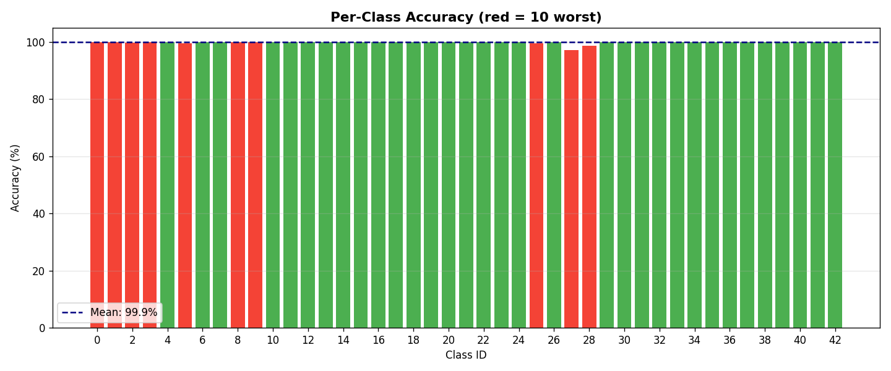
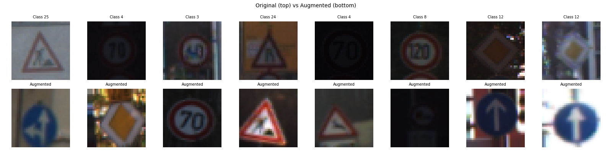
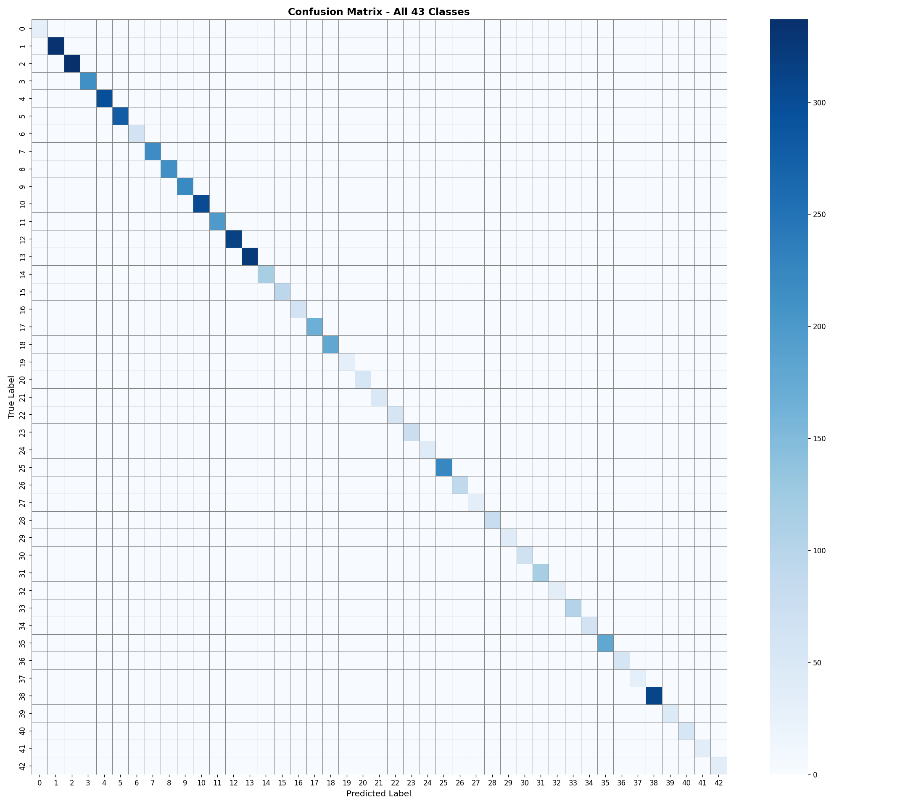
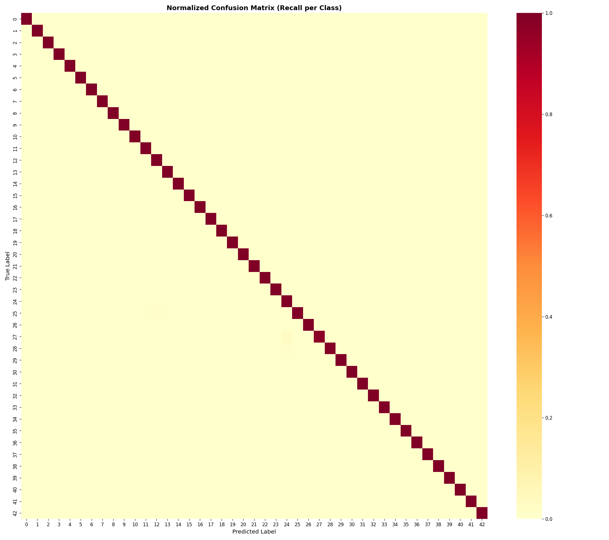

# 🚦 Traffic Sign Recognition for Autonomous Vehicles

<div align="center">

**A high-accuracy deep learning model for real-time traffic sign recognition, trained on the GTSRB dataset, capable of classifying 43 traffic sign categories with 99.9% validation accuracy.**

*Developed during internship at **InLighnx Global***

</div>

---

## 📋 Table of Contents

- [Overview](#-overview)
- [Demo](#-demo)
- [Model Performance](#-model-performance)
- [Dataset & Classes](#-dataset--classes)
- [Project Structure](#-project-structure)
- [Installation](#-installation)
- [Usage](#-usage)
- [Training Pipeline](#-training-pipeline)
- [Results & Visualizations](#-results--visualizations)
- [Tech Stack](#-tech-stack)
- [Acknowledgements](#-acknowledgements)

---

## 🔍 Overview

This project implements a **Convolutional Neural Network (CNN)** for traffic sign classification, designed for integration into autonomous vehicle pipelines. The model is trained on the **German Traffic Sign Recognition Benchmark (GTSRB)** dataset and achieves near-perfect accuracy across all 43 sign categories.

### Key Highlights

- ✅ **99.9% validation accuracy** across 43 classes
- ✅ Real-time **live webcam inference** with uncertainty estimation
- ✅ **Data augmentation** pipeline for robust generalization
- ✅ **Entropy-based confidence filtering** to suppress false positives
- ✅ Supports both `.keras` and `.h5` model formats
- ✅ Inference script with **Top-K predictions** and confidence visualization

---

## 🎥 Demo

### Live Webcam Detection
The webcam module detects traffic signs in real time using your system camera. It draws a region-of-interest (ROI) box and displays the top predictions with confidence scores.

> All predictions shown in **green** = correct. The model correctly classifies signs even under varying lighting, angle, and resolution conditions.

---

## 📊 Model Performance

| Metric | Value |
|---|---|
| **Validation Accuracy** | **99.83%** |
| **Mean Per-Class Accuracy** | **99.9%** |
| **Number of Classes** | 43 |
| **Input Size** | 32 × 32 × 3 |
| **Training Epochs** | ~27 |

### Training Curves


- Validation accuracy reaches **99.83%** and stabilizes within the first 5 epochs.
- Validation loss consistently approaches **0**, indicating strong generalization with no significant overfitting.

### Per-Class Accuracy


Nearly every class achieves **100% accuracy**. The 10 lowest-performing classes (shown in red) still exceed **97%**, demonstrating highly robust per-class performance.

---

## 🗂️ Dataset & Classes

The model is trained on the **[GTSRB — German Traffic Sign Recognition Benchmark](https://benchmark.ini.rub.de/gtsrb_news.html)** dataset.

- **Total Images:** ~51,000+ annotated traffic sign images
- **Classes:** 43 unique traffic sign categories
- **Image Size:** Variable (resized to 32×32 for training)

> ⚠️ **Note:** The trained model files (`.keras` / `.h5`) are not included in this repository due to file size. You can train the model yourself using the GTSRB dataset, or contact the author for the weights.

<details>
<summary>📄 View All 43 Classes</summary>

| ID | Class Name | ID | Class Name |
|---|---|---|---|
| 0 | Speed limit (20km/h) | 22 | Bumpy road |
| 1 | Speed limit (30km/h) | 23 | Slippery road |
| 2 | Speed limit (50km/h) | 24 | Road narrows (right) |
| 3 | Speed limit (60km/h) | 25 | Road work |
| 4 | Speed limit (70km/h) | 26 | Traffic signals |
| 5 | Speed limit (80km/h) | 27 | Pedestrians |
| 6 | End of speed limit (80km/h) | 28 | Children crossing |
| 7 | Speed limit (100km/h) | 29 | Bicycles crossing |
| 8 | Speed limit (120km/h) | 30 | Beware of ice/snow |
| 9 | No passing | 31 | Wild animals crossing |
| 10 | No passing (>3.5t) | 32 | End of speed+passing limits |
| 11 | Right-of-way at intersection | 33 | Turn right ahead |
| 12 | Priority road | 34 | Turn left ahead |
| 13 | Yield | 35 | Ahead only |
| 14 | Stop | 36 | Go straight or right |
| 15 | No vehicles | 37 | Go straight or left |
| 16 | No vehicles (>3.5t) | 38 | Keep right |
| 17 | No entry | 39 | Keep left |
| 18 | General caution | 40 | Roundabout mandatory |
| 19 | Dangerous curve (left) | 41 | End of no passing |
| 20 | Dangerous curve (right) | 42 | End of no passing (>3.5t) |
| 21 | Double curve | | |

</details>

---

## 📁 Project Structure

```
Traffic-Sign-Recognition-for-Autonomous-Vehicles/
│
├──  results/
│   ├── augmentation_preview.png          # Data augmentation visualization
│   ├── confusion_matrix_full.png         # Full confusion matrix (43 classes)
│   ├── confusion_matrix_normalized.png   # Normalized confusion matrix (recall per class)
│   ├── per_class_accuracy.png            # Per-class accuracy bar chart
│   ├── sample_predictions.png            # Sample model predictions
│   └── training_curves.png              # Training & validation accuracy/loss curves
├── class_names.json                      # List of 43 class label names
├── predict.py                            # Single image prediction script (GUI file picker)
├── webcam_live.py                        # Real-time webcam inference script
├── requirements.txt                      # Python dependencies
└── README.md
```

> 💡 Model files (`.keras`, `.h5`) are excluded from the repo. Place them in the root directory before running inference scripts.

---

## ⚙️ Installation

### Prerequisites

- Python 3.8 or higher
- A webcam (only required for `webcam_live.py`)
- CUDA-compatible GPU (optional, recommended for training)

### 1. Clone the Repository

```bash
git clone https://github.com/Divyanshu409/Traffic-Sign-Recognition-for-Autonomous-Vehicles.git
cd Traffic-Sign-Recognition-for-Autonomous-Vehicles
```

### 2. Install Dependencies

```bash
pip install -r requirements.txt
```

**Core dependencies:**

```
tensorflow>=2.10
opencv-python
numpy
matplotlib
scipy
```

### 3. Add Model File

Download or train the model and place it in the root directory:

```
Traffic-Sign-Recognition-for-Autonomous-Vehicles/
├── traffic_sign_recognition_model.keras   ← place here
├── predict.py
├── webcam_live.py
└── ...
```

---

## 🚀 Usage

### 🖼️ Single Image Prediction

Run the prediction script. A file picker dialog will open — select any traffic sign image (`.jpg`, `.png`, `.bmp`, `.ppm`).

```bash
python predict.py
```

**Output:**
- Top-1 prediction with confidence percentage
- Top-3 ranked predictions displayed in a bar chart
- Side-by-side visualization of the input image and predictions

### 📷 Live Webcam Inference

```bash
python webcam_live.py
```

**How it works:**
1. A yellow ROI box appears at the center of the webcam feed.
2. Hold any traffic sign inside the box.
3. The model predicts in real time, showing the label and confidence score.
4. Predictions below the confidence threshold or above the entropy threshold are suppressed and shown as **"No sign detected"**.
5. Press **`Q`** to quit.

**Configurable parameters in `webcam_live.py`:**

| Parameter | Default | Description |
|---|---|---|
| `CONFIDENCE_THRESHOLD` | `70.0` | Minimum confidence (%) to accept a prediction |
| `UNCERTAINTY_THRESHOLD` | `0.55` | Max normalized entropy; higher = reject as uncertain |
| `ROI_FRACTION` | `0.55` | Fraction of the frame used as the detection ROI |

---

## 🧠 Training Pipeline

The model was trained using the following pipeline:

### Data Augmentation

To improve robustness, the following augmentations were applied during training:



- Random rotation
- Brightness and contrast jitter
- Horizontal/vertical shifts
- Zoom and shear transforms
- Random flips (where class-appropriate)

### Model Architecture

A custom CNN architecture was designed with:
- Multiple **Conv2D + BatchNorm + MaxPooling** blocks
- **Dropout** layers for regularization
- **Dense** classification head with Softmax output (43 classes)
- **ModelCheckpoint** callback saving the best validation accuracy weights

### Training Configuration

| Parameter | Value |
|---|---|
| Optimizer | Adam |
| Loss Function | Categorical Crossentropy |
| Input Shape | (32, 32, 3) |
| Output Classes | 43 |
| Best Val Accuracy | 99.83% |

---

## 📈 Results & Visualizations

### Confusion Matrix — All 43 Classes


The dominant diagonal confirms that predictions are overwhelmingly correct across all 43 categories, with negligible off-diagonal misclassifications.

### Normalized Confusion Matrix (Recall per Class)


The normalized matrix (recall per class) shows near-perfect recall for every class, confirming the model does not systematically fail on any category.

---

## 🛠️ Tech Stack

| Technology | Purpose |
|---|---|
| **TensorFlow / Keras** | Model building, training, saving |
| **OpenCV** | Image preprocessing, webcam capture |
| **NumPy** | Numerical operations |
| **Matplotlib** | Visualization of results |
| **SciPy** | Entropy-based uncertainty estimation |
| **Tkinter** | GUI file picker for `predict.py` |

---

## 🙏 Acknowledgements

- Dataset: **[GTSRB — German Traffic Sign Recognition Benchmark](https://benchmark.ini.rub.de/gtsrb_news.html)** by Institut für Neuroinformatik, Ruhr-Universität Bochum.
- Internship Organization: **InLighnx Global**
- Developed by: **[Divyanshu409](https://github.com/Divyanshu409)**

---
